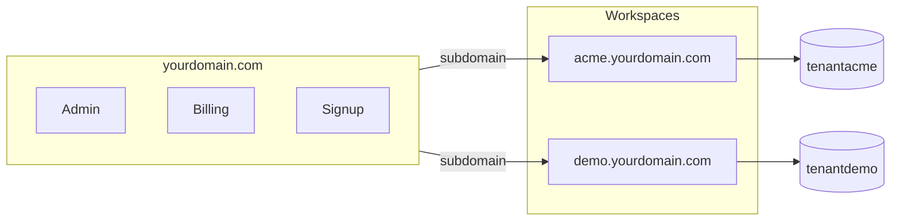

# Laravel Tenant Kit

[](https://github.com/mohammedelkarsh/laravel-tenant-kit/actions/workflows/tests.yml)
[](LICENSE)
[](https://github.com/mohammedelkarsh/laravel-tenant-kit/releases/tag/v1.0.0)
[](https://github.com/mohammedelkarsh/laravel-tenant-kit/stargazers)

## Build production-ready multi-tenant SaaS apps in minutes — not weeks.

Laravel-based, scalable, and ready for real customers.  
One codebase · isolated database per workspace · Stripe billing · Filament admin.

> **v1.0.0 — Stable foundation** · [View release notes](https://github.com/mohammedelkarsh/laravel-tenant-kit/releases/tag/v1.0.0)

---

### If this saves you time, please leave a star — it helps the project reach more developers.

[](https://github.com/mohammedelkarsh/laravel-tenant-kit/stargazers)

---

## Why this exists

Most SaaS developers spend **weeks** rebuilding the same foundation: tenancy, auth, billing, admin panel, teams.

This kit removes that burden — so you start building your **product** on day one.

| Without this kit | With this kit |
|------------------|---------------|
| 2–3 months of infrastructure work | **~10 minutes** to a running multi-tenant app |
| Roll your own tenant isolation | Database-per-tenant, built in |
| Wire Stripe + admin from scratch | Cashier + Filament included |
| Guess at production patterns | CI, smoke tests, deployment docs |

---

## Who is this for?

Developers building **SaaS products with Laravel** who want a real starting point — not a tutorial snippet.

**Great for:**

- SaaS platforms
- B2B subscription apps
- Internal multi-workspace tools
- CRM / project tools with per-customer isolation
- Arabic + English products (RTL ready)

---

## What's included

- Multi-tenancy with **full database isolation** per workspace
- Subdomain + custom domain routing
- Authentication (Laravel Breeze) — central app **and** each workspace
- Teams, roles & permissions (owner / admin / member)
- Email invitations
- Stripe subscriptions (Laravel Cashier) per workspace
- Filament admin panel (`/admin`)
- Workspace signup + CLI provisioning
- **English & Arabic** (RTL) — easy to add more languages
- GitHub Actions CI + 30-point smoke test script

---

## At a glance

✔ Create isolated workspaces in seconds  
✔ Each customer runs in **complete isolation** (separate database)  
✔ Stripe billing scaffold ready  
✔ Filament admin to manage all workspaces  
✔ Production-minded structure — extend, don't rewrite  
✔ i18n: English + Arabic out of the box  

**Tech stack:** Laravel 13 · PHP 8.4 · Filament 5 · Stancl Tenancy · Spatie Permission · Cashier (Stripe) · Breeze · Tailwind · Vite · MySQL

---

## Screenshots

| Landing page | Admin panel |
|:---:|:---:|
|  |  |

| Tenant dashboard | Billing |
|:---:|:---:|
|  |  |

| Team management | |
|:---:|:---:|
|  | |

> **Live demo** (after `db:seed`): [demo workspace](http://demo.laravel-tenant-kit.test) · [admin panel](/admin)

---

## Quick start

```bash
git clone https://github.com/mohammedelkarsh/laravel-tenant-kit.git
cd laravel-tenant-kit
composer install && npm install
cp .env.example .env && php artisan key:generate
php artisan migrate && php artisan db:seed && npm run build
```

Add to hosts: `127.0.0.1 laravel-tenant-kit.test` and `127.0.0.1 demo.laravel-tenant-kit.test`

Open `http://laravel-tenant-kit.test` — done.

<details>
<summary><strong>Full local setup (.env, credentials, verify)</strong></summary>

### Configure `.env`

```env
APP_URL=http://laravel-tenant-kit.test
CENTRAL_DOMAIN=laravel-tenant-kit.test
DB_DATABASE=laravel_tenant_kit
DB_USERNAME=root
DB_PASSWORD=your_password
APP_AVAILABLE_LOCALES=en,ar
```

### Default credentials

| Context | URL | Email | Password |
|---------|-----|-------|----------|
| Admin | `/admin` | `admin@laravel-tenant-kit.test` | `password` |
| Demo workspace | `http://demo.laravel-tenant-kit.test` | `demo@demo.test` | `password` |

### Verify

```bash
php scripts/system-test.php   # expect 30/30 passed
```

</details>

---

## How it works

One Laravel app serves everyone. Each workspace gets its own database — **no code is copied**, no separate deployment per customer.



When someone visits `acme.yourdomain.com`, Laravel identifies the workspace from the URL and connects to `tenantacme` automatically.

<details>
<summary><strong>What happens when a workspace is created?</strong></summary>

1. Record in `tenants` + `domains` tables (central DB)
2. New database `tenant{id}` is created
3. Tenant migrations + role seeds run automatically
4. User is redirected to `http://{id}.yourdomain.com`

**CLI** (with owner account):

```bash
php artisan tenant:provision acme "Acme Corp" --admin=boss@acme.com --password=secret
```

</details>

---

## Design philosophy

Built for **scalability**, **clean separation**, and **developer experience**:

- Central platform logic stays on the main domain
- Tenant data never mixes — isolated databases
- Extend via services, Filament resources, and tenant migrations
- Sensible defaults; no magic you can't trace

---

## Production-ready proof

- GitHub Actions CI on every push
- `scripts/system-test.php` — 30 automated checks (HTTP, DB, auth, i18n)
- Tenant-aware cache, filesystem, and queue bootstrappers (Stancl)
- Config / route / view caching documented for deploy
- Wildcard subdomain + SSL deployment guide below

---

## Localization

**English & Arabic included** — RTL works out of the box. Add more languages in `config/locales.php`.

```env
APP_AVAILABLE_LOCALES=en,ar
```

<details>
<summary><strong>Add a new language (e.g. French)</strong></summary>

1. Register in `config/locales.php`
2. Set `APP_AVAILABLE_LOCALES=en,ar,fr`
3. Copy `lang/en/app.php` → `lang/fr/app.php` and translate
4. Run `php artisan optimize:clear`

</details>

---

## Stripe billing (optional)

```env
STRIPE_KEY=pk_test_...
STRIPE_SECRET=sk_test_...
STRIPE_PRICE_STARTER=price_...
STRIPE_PRICE_PRO=price_...
```

Visit `/billing/demo` while logged in as platform admin.

---

## Custom domains

Filament → workspace → **Domains** → add `app.client.com` → point DNS to your server.

---

## Production deployment

```
yourdomain.com     →  A  →  server IP
*.yourdomain.com   →  A  →  server IP   # wildcard required
```

MySQL user needs `CREATE DATABASE` permission. **VPS / Laravel Forge recommended** over shared hosting.

```bash
php artisan migrate --force && php artisan config:cache && php artisan view:cache
```

<details>
<summary><strong>Hosting notes & troubleshooting</strong></summary>

### Recommended hosting

| Type | Fit |
|------|-----|
| VPS / Cloud | ✅ Best |
| Laravel Forge / Ploi | ✅ Best |
| Shared hosting | ⚠️ Limited (wildcard DNS, DB creation) |

### Common fixes

**`/admin` 500 after login (Windows):**
```bash
php artisan optimize:clear && php artisan view:cache
```

**Tenant subdomain 404:** check wildcard DNS + domain record in Filament.

**No CSS on tenant:** run `npm run build`.

</details>

---

## Roadmap

Planned for upcoming releases — contributions welcome:

- [ ] OAuth / social login (Google, GitHub)
- [ ] SaaS analytics dashboard
- [ ] Video demo GIF in README
- [ ] Docker Compose dev environment
- [ ] API tokens per workspace
- [ ] Usage-based billing meters

---

## Project structure

```
app/Services/TenantProvisioner.php   # workspace creation logic
app/Filament/                        # admin panel
routes/web.php                       # central domain
routes/tenant.php                    # all workspace subdomains
database/migrations/tenant/          # per-tenant schema
lang/en|ar/                          # translations
scripts/system-test.php              # smoke tests
```

---

## Contributing

Issues and PRs welcome. Open an issue first for large changes.

---

## License

MIT — see [LICENSE](LICENSE).

---

<p align="center">
  <strong>Help this project grow</strong> — <a href="https://github.com/mohammedelkarsh/laravel-tenant-kit/stargazers">leave a ⭐ on GitHub</a>
</p>
