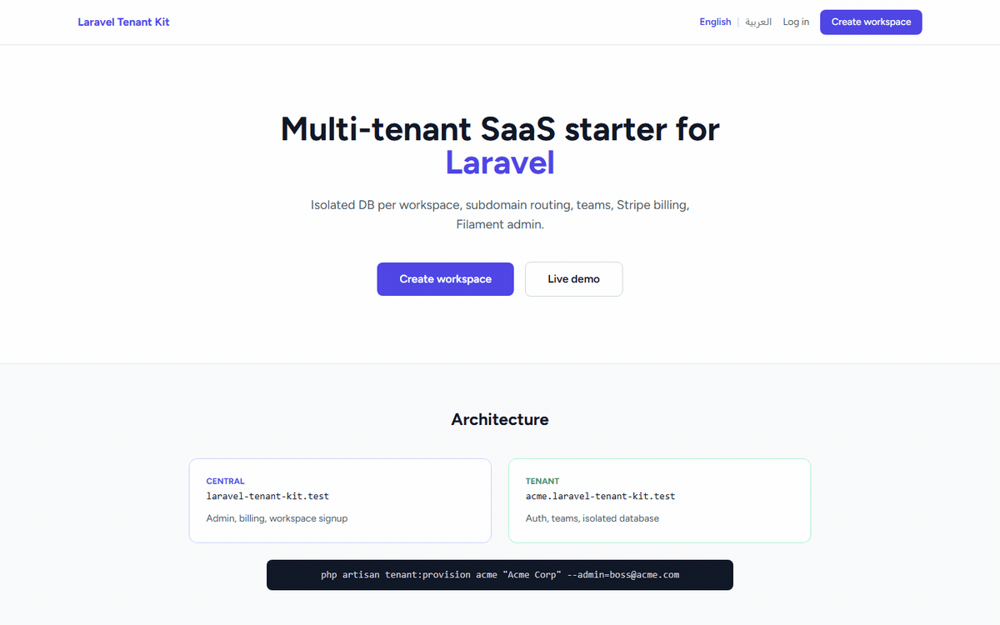
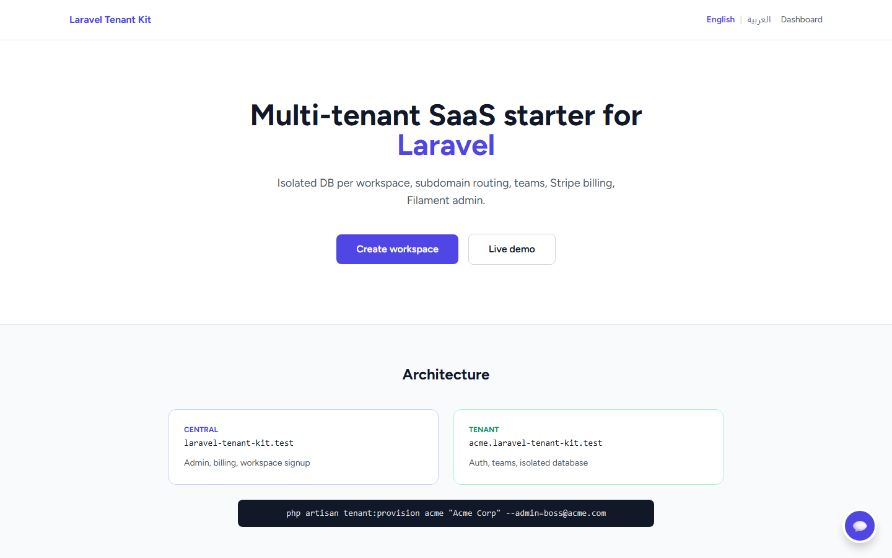
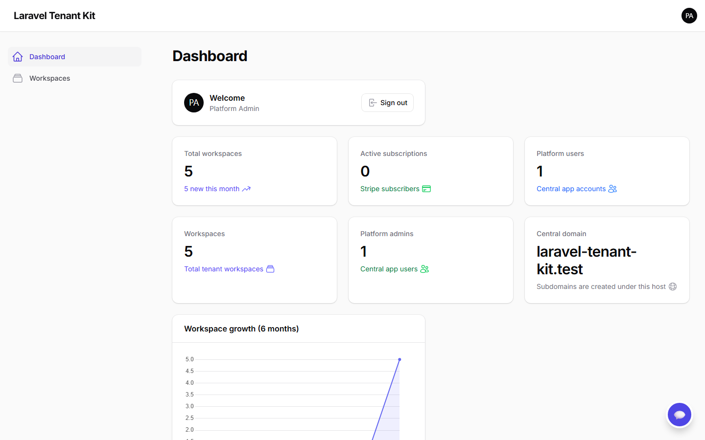
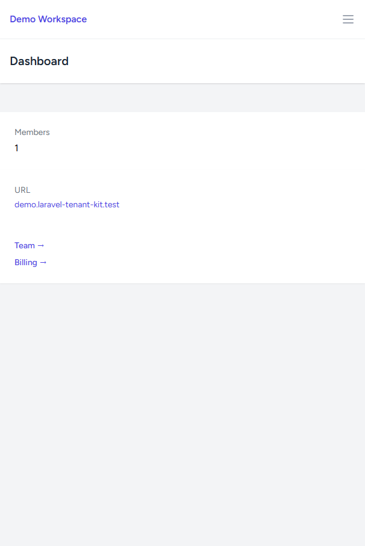
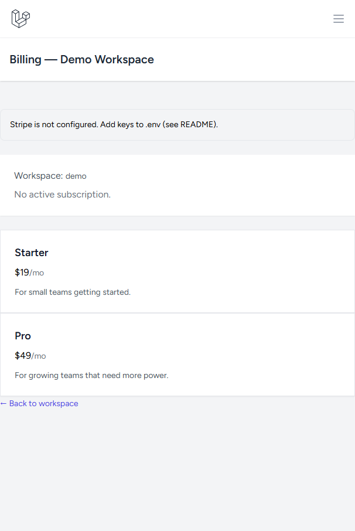
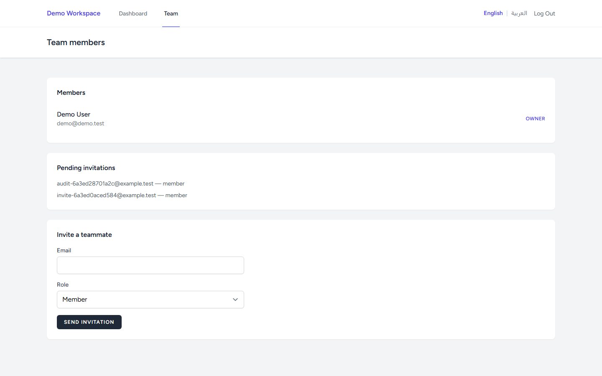
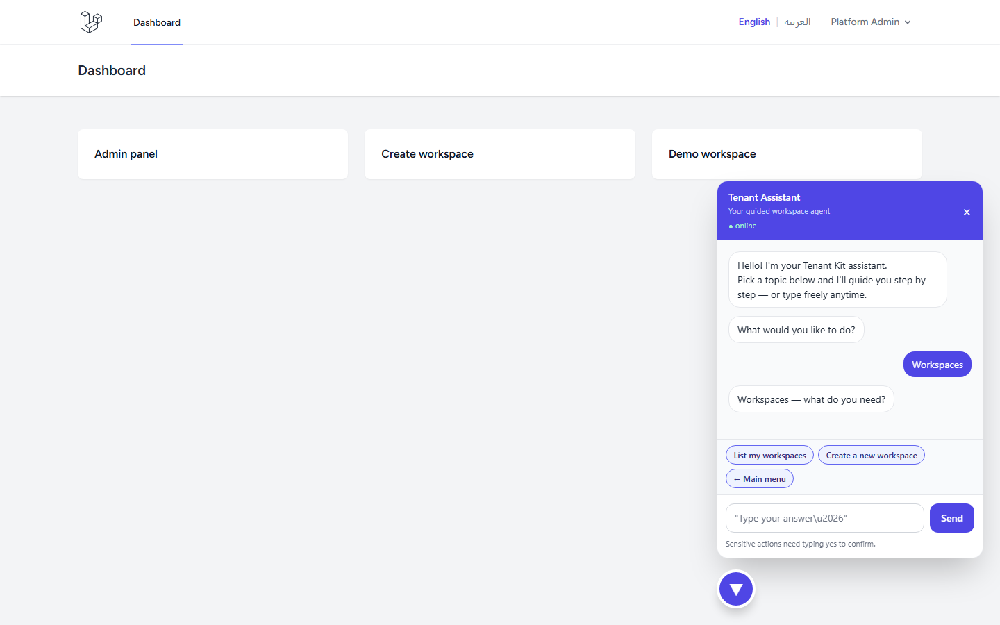
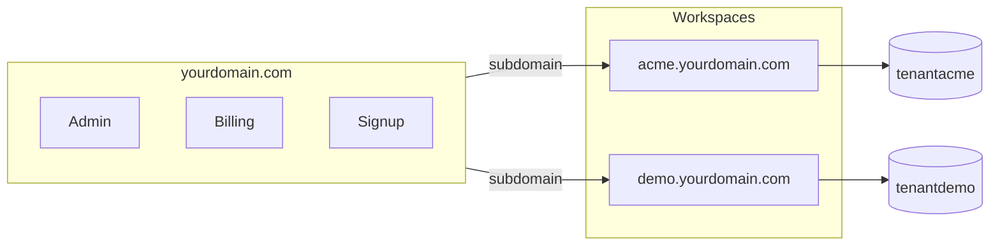

# Laravel Tenant Kit

[](https://github.com/mohammedelkarsh/laravel-tenant-kit/actions/workflows/tests.yml)
[](LICENSE)
[](https://github.com/mohammedelkarsh/laravel-tenant-kit/releases/latest)
[](https://github.com/mohammedelkarsh/laravel-tenant-kit/stargazers)

## Build production-ready multi-tenant SaaS apps in minutes — not weeks.

Laravel-based, scalable, and ready for real customers.  
One codebase · isolated database per workspace · Stripe billing · Filament admin.

> **v1.3.1** — [api-operator](https://pypi.org/project/api-operator/) + **in-app guided agent** · [docs/api-operator.md](docs/api-operator.md)  
> **v1.3.0** — Usage-based billing · [CHANGELOG](CHANGELOG.md)  
> **v1.2.1** — API rate limiting, token abilities, team invites · [Release notes](https://github.com/mohammedelkarsh/laravel-tenant-kit/releases/tag/v1.2.1)

---

### If this saves you time, please leave a star — it helps the project reach more developers.

[](https://github.com/mohammedelkarsh/laravel-tenant-kit/stargazers)

---

## Why this exists

Most SaaS developers spend **weeks** rebuilding the same foundation: tenancy, auth, billing, admin panel, teams.

This kit removes that burden — so you start building your **product** on day one.

| Without this kit | With this kit |
|------------------|---------------|
| 2–3 months of infrastructure work | **~10 minutes** to a running multi-tenant app |
| Roll your own tenant isolation | Database-per-tenant, built in |
| Wire Stripe + admin from scratch | Cashier + Filament included |
| Guess at production patterns | CI, smoke tests, deployment docs |

---

## Who is this for?

Developers building **SaaS products with Laravel** who want a real starting point — not a tutorial snippet.

**Great for:**

- SaaS platforms
- B2B subscription apps
- Internal multi-workspace tools
- CRM / project tools with per-customer isolation
- Arabic + English products (RTL ready)

---

## What's included

- Multi-tenancy with **full database isolation** per workspace
- Subdomain + custom domain routing
- Authentication (Laravel Breeze) — central app **and** each workspace
- Teams, roles & permissions (owner / admin / member)
- Email invitations
- Stripe subscriptions (Laravel Cashier) per workspace
- Filament admin panel (`/admin`)
- Workspace signup + CLI provisioning
- **English & Arabic** (RTL) — easy to add more languages
- GitHub Actions CI + **71 PHPUnit tests** + **43-point** smoke test + **44-scenario** page audit
- **Docker Compose** dev stack (PHP, Nginx, MySQL, Redis)
- **PostgreSQL** supported (Stancl database-per-tenant)
- **Redis** cache / queue / sessions with tenant key isolation
- **OAuth** login (Google, GitHub) on the central app
- **Sanctum API** tokens — central platform + per-workspace tenant API (abilities + rate limiting)
- **SaaS analytics** widgets in Filament (growth chart, subscriptions, users)
- **Workspace suspension** from Filament admin
- **Usage-based billing** meters (`api_calls`, `team_seats`) with optional Stripe sync
- **[api-operator](https://pypi.org/project/api-operator/)** YAML adapter + **in-app guided agent** (chat widget on central domain) — [guide](docs/api-operator.md)

---

## At a glance

✔ Create isolated workspaces in seconds  
✔ Each customer runs in **complete isolation** (separate database)  
✔ Stripe billing scaffold ready  
✔ Filament admin to manage all workspaces  
✔ Production-minded structure — extend, don't rewrite  
✔ i18n: English + Arabic out of the box  

**Tech stack:** Laravel 13 · PHP 8.4 · Filament 5 · Stancl Tenancy · Spatie Permission · Cashier (Stripe) · Breeze · Tailwind · Vite · MySQL / PostgreSQL · Redis · Docker

---

## Demo (GIF)

Workspace signup → tenant login → dashboard → team → Filament analytics → **guided agent chat** (after `db:seed` + `operator` profile):



---

## Screenshots

| Landing page | Admin panel (SaaS analytics) |
|:---:|:---:|
|  |  |

| Tenant dashboard | Billing |
|:---:|:---:|
|  |  |

| Team management | Guided agent (api-operator) |
|:---:|:---:|
|  |  |

> **Live demo** (after `db:seed`): [demo workspace](http://demo.laravel-tenant-kit.test:8080) (Docker) or [without port](http://demo.laravel-tenant-kit.test) (Laragon) · [admin panel](http://laravel-tenant-kit.test:8080/admin) · log in on central domain to use the chat widget

---

## Quick start

```bash
git clone https://github.com/mohammedelkarsh/laravel-tenant-kit.git
cd laravel-tenant-kit
composer install && npm install
cp .env.example .env && php artisan key:generate
php artisan migrate && php artisan db:seed && npm run build
```

Add to hosts: `127.0.0.1 laravel-tenant-kit.test` and `127.0.0.1 demo.laravel-tenant-kit.test`

Open `http://laravel-tenant-kit.test` — done.

### Docker (alternative)

No Laragon? Run the full stack in one command:

```bash
# Windows
.\scripts\docker-setup.ps1

# macOS / Linux
chmod +x scripts/docker-setup.sh && ./scripts/docker-setup.sh
```

Open **http://laravel-tenant-kit.test:8080** (demo: **http://demo.laravel-tenant-kit.test:8080**) — Docker uses port **8080**, not 80. See [docs/docker.md](docs/docker.md).

<details>
<summary><strong>Full local setup (.env, credentials, verify)</strong></summary>

### Configure `.env`

```env
APP_URL=http://laravel-tenant-kit.test
APP_PORT_ALT=8080
CENTRAL_DOMAIN=laravel-tenant-kit.test
DB_DATABASE=laravel_tenant_kit
DB_USERNAME=root
DB_PASSWORD=your_password
APP_AVAILABLE_LOCALES=en,ar
```

For Docker on port **8080**, set `APP_URL=http://laravel-tenant-kit.test:8080` (see `.env.docker`).

### Default credentials

| Context | URL | Email | Password |
|---------|-----|-------|----------|
| Admin | `/admin` | `admin@laravel-tenant-kit.test` | `password` |
| Demo workspace | `http://demo.laravel-tenant-kit.test` (Laragon) or `:8080` (Docker) | `demo@demo.test` | `password` |

### Verify

```bash
php scripts/system-test.php   # expect 43/43 passed
```

</details>

---

## How it works

One Laravel app serves everyone. Each workspace gets its own database — **no code is copied**, no separate deployment per customer.



When someone visits `acme.yourdomain.com`, Laravel identifies the workspace from the URL and connects to `tenantacme` automatically.

<details>
<summary><strong>What happens when a workspace is created?</strong></summary>

1. Record in `tenants` + `domains` tables (central DB)
2. New database `tenant{id}` is created
3. Tenant migrations + role seeds run automatically
4. User is redirected to `http://{id}.yourdomain.com`

**CLI** (with owner account):

```bash
php artisan tenant:provision acme "Acme Corp" --admin=boss@acme.com --password=secret
```

</details>

---

## Design philosophy

Built for **scalability**, **clean separation**, and **developer experience**:

- Central platform logic stays on the main domain
- Tenant data never mixes — isolated databases
- Extend via services, Filament resources, and tenant migrations
- Sensible defaults; no magic you can't trace

---

## PostgreSQL

Switch from MySQL by changing `.env`:

```env
DB_CONNECTION=pgsql
DB_HOST=127.0.0.1
DB_PORT=5432
DB_DATABASE=laravel_tenant_kit
DB_USERNAME=laravel
DB_PASSWORD=secret
```

Stancl creates isolated `tenant{id}` databases on PostgreSQL the same way as MySQL.  
Docker: `docker compose --profile pgsql up -d` — see [docs/docker.md](docs/docker.md).

---

## Redis (production / Docker)

Enable Redis for cache, queues, and sessions:

```env
CACHE_STORE=redis
QUEUE_CONNECTION=redis
SESSION_DRIVER=redis
REDIS_HOST=127.0.0.1
TENANCY_USE_REDIS_BOOTSTRAPPER=true
```

`TENANCY_USE_REDIS_BOOTSTRAPPER` prefixes Redis keys per workspace so tenant data never leaks.  
Pre-configured in `.env.docker`.

---

## API & OAuth

**Sanctum tokens** for headless clients and mobile apps:

| Context | Base URL | Docs |
|---------|----------|------|
| Central platform | `https://your-domain.test/api` | [docs/api.md](docs/api.md) |
| Workspace (tenant) | `https://{workspace}.your-domain.test/api` | [docs/api.md](docs/api.md) |

```bash
# Issue a central API token
curl -X POST https://laravel-tenant-kit.test/api/auth/token \
  -H "Content-Type: application/json" \
  -d '{"email":"admin@laravel-tenant-kit.test","password":"password","device_name":"cli"}'
```

**OAuth** (Google, GitHub) — add credentials to `.env`; login buttons appear automatically on the central login page.

Filament `/admin` includes **SaaS analytics** widgets: workspace growth, active Stripe subscriptions, platform users.

---

## AI operator (api-operator)

Use [api-operator](https://pypi.org/project/api-operator/) to manage workspaces — from the **terminal** or the **in-app guided agent** (floating chat on the central domain when logged in).

### In-app guided agent

1. Enable in `.env` (included in `.env.docker`):

```env
API_OPERATOR_ENABLED=true
API_OPERATOR_URL=http://127.0.0.1:8100
```

2. Start the operator (`pip install api-operator==0.10.0` or Docker — see below).
3. Log in on the central domain → open `/dashboard` or `/admin` → click the chat button (bottom-right).

Flows: create workspace, check usage/subscription, invite teammates — with confirm step for dangerous actions.

### CLI

```bash
pip install api-operator==0.10.0
export TENANT_KIT_API_TOKEN="your-sanctum-token"

api-operator chat \
  --adapter yaml \
  --config integrations/api-operator/adapter.yaml \
  --base-url http://laravel-tenant-kit.test:8080
```

### Docker (recommended)

```powershell
# First time
.\scripts\docker-setup.ps1

# Daily
.\scripts\docker-up.ps1
```

Full setup (tokens, HTTP server, integration test): **[docs/api-operator.md](docs/api-operator.md)**.

---

## Production-ready proof

- GitHub Actions CI on every push
- `scripts/system-test.php` — 43 automated checks (HTTP, DB, auth, API, i18n)
- `scripts/page-audit.php` — 44 page/scenario checks (guest, auth, Filament, API, suspend)
- Tenant-aware cache, filesystem, queue, and Redis bootstrappers (Stancl)
- Docker Compose for reproducible local dev
- Config / route / view caching documented for deploy
- Wildcard subdomain + SSL deployment guide below

---

## Localization

**English & Arabic included** — RTL works out of the box. Add more languages in `config/locales.php`.

```env
APP_AVAILABLE_LOCALES=en,ar
```

<details>
<summary><strong>Add a new language (e.g. French)</strong></summary>

1. Register in `config/locales.php`
2. Set `APP_AVAILABLE_LOCALES=en,ar,fr`
3. Copy `lang/en/app.php` → `lang/fr/app.php` and translate
4. Run `php artisan optimize:clear`

</details>

---

## Stripe billing (optional)

```env
STRIPE_KEY=pk_test_...
STRIPE_SECRET=sk_test_...
STRIPE_PRICE_STARTER=price_...
STRIPE_PRICE_PRO=price_...
```

Visit `/billing/demo` while logged in as platform admin.

---

## Custom domains

Filament → workspace → **Domains** → add `app.client.com` → point DNS to your server.

---

## Production deployment

```
yourdomain.com     →  A  →  server IP
*.yourdomain.com   →  A  →  server IP   # wildcard required
```

MySQL user needs `CREATE DATABASE` permission. **VPS / Laravel Forge recommended** over shared hosting.

```bash
php artisan migrate --force && php artisan config:cache && php artisan view:cache
```

<details>
<summary><strong>Hosting notes & troubleshooting</strong></summary>

### Recommended hosting

| Type | Fit |
|------|-----|
| VPS / Cloud | ✅ Best |
| Laravel Forge / Ploi | ✅ Best |
| Shared hosting | ⚠️ Limited (wildcard DNS, DB creation) |

### Common fixes

**`/admin` 500 after login (Windows):**
```bash
php artisan optimize:clear && php artisan view:cache
```

**Tenant subdomain 404:** check wildcard DNS + domain record in Filament.

**No CSS on tenant:** run `npm run build`.

</details>

---

## Roadmap

- [x] Docker Compose dev environment
- [x] PostgreSQL support
- [x] Redis cache / queue with tenant isolation
- [x] OAuth / social login (Google, GitHub)
- [x] API tokens per workspace (Sanctum)
- [x] SaaS analytics dashboard
- [x] Video demo GIF in README
- [x] API rate limiting & token abilities (v1.2.1)
- [x] Workspace subscription API & team invites API (v1.2.1)
- [x] Workspace suspend from Filament (v1.2.1)
- [x] Usage-based billing meters (v1.3.0)
- [x] api-operator integration + in-app guided agent (v1.3.1)
- [ ] Optional KYC module (v1.4.0) — see [ROADMAP](docs/ROADMAP.md)
- [ ] Extended usage meters (v1.5.0)
- [ ] Platform webhooks + agent RAG (v1.6.0)

---

## Project structure

```
app/Services/ApiOperatorClient.php   # proxy to api-operator (server-side token)
app/Support/ApiOperator.php          # widget visibility rules
app/Services/TenantProvisioner.php   # workspace creation logic
app/Filament/                        # admin panel
resources/js/api-operator-widget.js  # guided agent UI
routes/web.php                       # central domain (+ /api-operator/*)
routes/tenant.php                    # all workspace subdomains
database/migrations/tenant/          # per-tenant schema
lang/en|ar/                          # translations (incl. agent menus)
scripts/system-test.php              # smoke tests
scripts/page-audit.php               # full page audit
scripts/docker-setup.ps1             # first-time Docker + operator
scripts/docker-up.ps1                # daily Docker start
docker-compose.yml                   # PHP + Nginx + MySQL + Redis + api-operator
integrations/api-operator/           # api-operator YAML adapter
docs/api-operator.md                 # AI operator setup guide
docs/docker.md                       # Docker & PostgreSQL guide
docs/api.md                          # Sanctum API & OAuth setup
```

---

## Contributing

Issues and PRs welcome. Open an issue first for large changes.

---

## License

MIT — see [LICENSE](LICENSE).

---

<p align="center">
  <strong>Help this project grow</strong> — <a href="https://github.com/mohammedelkarsh/laravel-tenant-kit/stargazers">leave a ⭐ on GitHub</a>
</p>
