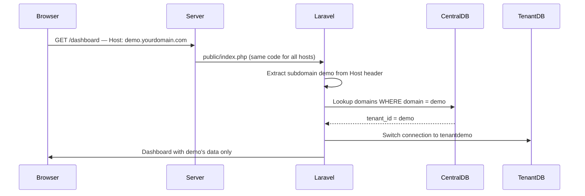
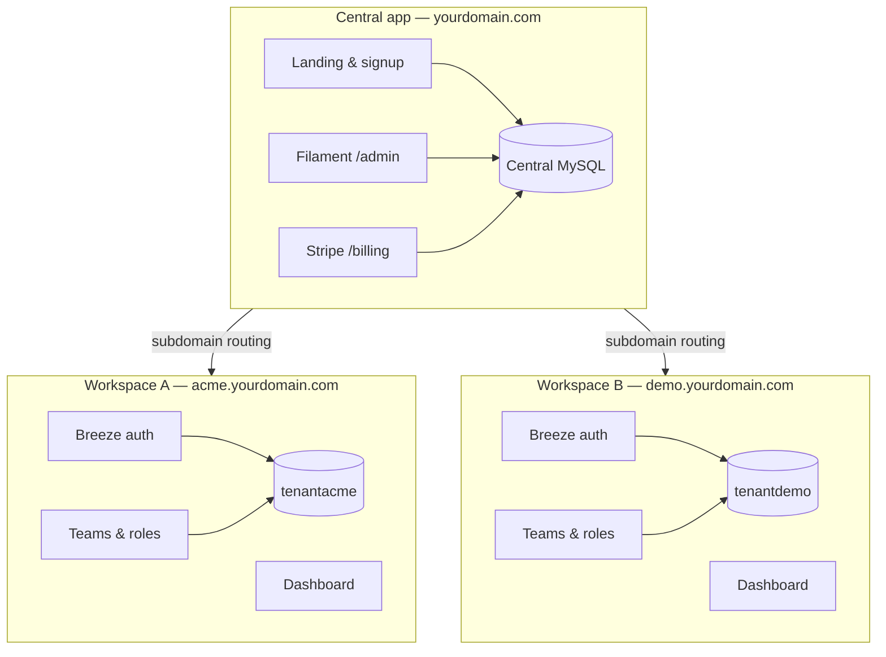

# Laravel Tenant Kit

[](https://github.com/mohammedelkarsh/laravel-tenant-kit/actions/workflows/tests.yml)
[](LICENSE)

**Production-ready Laravel starter for building multi-tenant SaaS products.**

One codebase, isolated database per workspace, subdomain routing, team permissions, Stripe subscriptions, Filament admin, and English/Arabic localization — wired and ready to extend.

## Screenshots

| Landing page | Admin panel |
|:---:|:---:|
|  |  |

| Tenant dashboard | Billing |
|:---:|:---:|
|  |  |

| Team management | |
|:---:|:---:|
|  | |

---

## Why this kit?

Most “multi-tenant Laravel” repos give you a thin shell. This project is a **complete foundation**:

| You get | Out of the box |
|---------|----------------|
| Tenant isolation | Separate MySQL database per workspace |
| Routing | Central domain + `{workspace}.yourdomain.com` |
| Auth | Laravel Breeze on central app **and** inside each workspace |
| Teams | Owner / admin / member roles + email invitations |
| Billing | Laravel Cashier (Stripe) billed per workspace |
| Admin | Filament panel to manage workspaces & domains |
| i18n | English + Arabic with RTL, extensible to more locales |
| CLI | `tenant:provision` to create workspaces from the terminal |

---

## How it works

**Important:** creating a workspace does **not** copy code or deploy a new app. All tenants share the **same Laravel installation**. Each workspace gets its own **database** and **domain record**.



### Architecture overview



| Layer | URL example | Responsibility |
|-------|-------------|----------------|
| **Central** | `yourdomain.com` | Marketing, workspace signup, platform admin, Stripe billing |
| **Tenant** | `acme.yourdomain.com` | End-user login, teams, workspace-specific data |
| **Database** | `tenant` + `{id}` | Full data isolation — e.g. `tenantacme`, `tenantdemo` |

### What happens when a workspace is created?

**Via web** (`/workspaces/create`) or **CLI** (`tenant:provision`):

1. A row is inserted into `tenants` (id = subdomain slug, e.g. `acme`)
2. A row is inserted into `domains` (domain = `acme`)
3. Stancl Tenancy automatically:
   - Creates database `tenantacme`
   - Runs migrations from `database/migrations/tenant/`
   - Seeds roles (owner, admin, member)
4. Browser redirects to `http://acme.yourdomain.com`

**Web vs CLI difference:**

| Method | Owner user created? |
|--------|---------------------|
| Web signup | No — first user registers manually on the workspace |
| CLI with `--admin=email` | Yes — owner account created inside tenant DB |

---

## Tech stack

- **Laravel 13** + PHP 8.4+
- **[Stancl Tenancy](https://tenancyforlaravel.com)** — database-per-tenant, subdomain & custom domain identification
- **Laravel Breeze** — authentication (central + tenant)
- **Filament 5** — platform admin panel
- **Spatie Permission** — roles inside each workspace
- **Laravel Cashier** — Stripe subscriptions per tenant
- **Tailwind CSS** + Vite

---

## Requirements

- PHP 8.4+
- Composer 2
- Node.js 20+
- MySQL 8+ (recommended) or SQLite for PHPUnit
- Web server with wildcard subdomain support (production)

---

## Quick start

### 1. Clone & install

```bash
git clone https://github.com/mohammedelkarsh/laravel-tenant-kit.git
cd laravel-tenant-kit

composer install
npm install
cp .env.example .env
php artisan key:generate
```

### 2. Configure `.env`

```env
APP_URL=http://laravel-tenant-kit.test
CENTRAL_DOMAIN=laravel-tenant-kit.test

DB_CONNECTION=mysql
DB_HOST=127.0.0.1
DB_DATABASE=laravel_tenant_kit
DB_USERNAME=root
DB_PASSWORD=your_password

APP_LOCALE=en
APP_AVAILABLE_LOCALES=en,ar
```

### 3. Migrate, seed & build assets

```bash
php artisan migrate
php artisan db:seed
npm run build
```

`db:seed` creates the platform admin, a **demo** workspace (`demo`), and owner user `demo@demo.test`.

### 4. Local domains

Add to your hosts file (Laragon/Valet often do this automatically):

```
127.0.0.1 laravel-tenant-kit.test
127.0.0.1 demo.laravel-tenant-kit.test
```

### 5. Verify

```bash
php scripts/system-test.php
```

Expected: **30/30 tests passed**.

---

## Default credentials

| Context | URL | Email | Password |
|---------|-----|-------|----------|
| Platform admin | `http://laravel-tenant-kit.test/admin` | `admin@laravel-tenant-kit.test` | `password` |
| Demo workspace | `http://demo.laravel-tenant-kit.test` | `demo@demo.test` | `password` |

---

## Key URLs

| URL | Description |
|-----|-------------|
| `/` | SaaS landing page |
| `/workspaces/create` | Create a new workspace (web) |
| `/admin` | Filament admin — manage all workspaces |
| `/billing/{workspace}` | Stripe subscription management (central) |
| `http://{workspace}.yourdomain.com` | Tenant workspace home |
| `http://{workspace}.yourdomain.com/team` | Team members & invitations |
| `/locale/{code}` | Switch language (session-based) |

---

## CLI — provision a workspace

Create a fully migrated workspace with an owner account:

```bash
php artisan tenant:provision acme "Acme Corp" \
  --admin=boss@acme.com \
  --password=secret
```

Add to hosts: `127.0.0.1 acme.laravel-tenant-kit.test`

Other useful commands:

```bash
php artisan tenants:migrate    # Run tenant migrations for all workspaces
php artisan tenants:seed       # Re-seed tenant databases
```

---

## Localization

English and Arabic are included. Users switch language from the header on the central app, tenant workspaces, and Filament admin.

### Configure enabled languages

```env
APP_LOCALE=en
APP_FALLBACK_LOCALE=en
APP_AVAILABLE_LOCALES=en,ar
```

English only: `APP_AVAILABLE_LOCALES=en`

### Add a new language (e.g. French)

1. Register in `config/locales.php`:

```php
'fr' => [
    'name' => 'French',
    'native' => 'Français',
    'dir' => 'ltr',
],
```

2. Enable in `.env`: `APP_AVAILABLE_LOCALES=en,ar,fr`

3. Copy and translate:

```bash
cp lang/en/app.php lang/fr/app.php
cp lang/ar.json lang/fr.json
```

4. Clear caches: `php artisan optimize:clear`

| File | Purpose |
|------|---------|
| `lang/{locale}/app.php` | Kit UI strings (landing, billing, team, Filament labels) |
| `lang/{locale}.json` | Breeze auth/profile strings |
| `config/locales.php` | Locale metadata (name, native label, text direction) |

---

## Stripe billing (optional)

Add to `.env`:

```env
STRIPE_KEY=pk_test_...
STRIPE_SECRET=sk_test_...
STRIPE_WEBHOOK_SECRET=whsec_...
STRIPE_PRICE_STARTER=price_...
STRIPE_PRICE_PRO=price_...
```

Visit `/billing/demo` while logged in as the platform admin to test checkout. Billing runs on the **central** domain because Cashier is attached to the `Tenant` model in the central database.

---

## Custom domains

1. Open a workspace in Filament → **Domains** tab
2. Add the full domain (e.g. `app.acme.com`)
3. Point DNS A/CNAME to your server
4. Tenancy resolves via `InitializeTenancyByDomainOrSubdomain`

---

## Production deployment

### DNS (required for subdomains)

Configure a **wildcard** record so every workspace subdomain hits the same server:

```
yourdomain.com      →  A  →  server IP
*.yourdomain.com    →  A  →  server IP
```

Use a **wildcard SSL** certificate (Let's Encrypt DNS challenge or commercial wildcard).

### MySQL permissions

The app creates databases programmatically (`tenant{id}`). Your MySQL user needs `CREATE DATABASE` permission.

### Recommended hosting

| Hosting type | Suitability |
|--------------|-------------|
| VPS / Cloud (Forge, Hetzner, DO) | ✅ Recommended |
| Laravel-specialized (Laravel Cloud, Ploi) | ✅ Recommended |
| Shared hosting (SiteGround, etc.) | ⚠️ Limited — wildcard DNS, DB creation, and Laravel constraints |

### Environment

```env
APP_ENV=production
APP_DEBUG=false
CENTRAL_DOMAIN=yourdomain.com
APP_URL=https://yourdomain.com
```

Run after deploy:

```bash
php artisan migrate --force
php artisan db:seed --force
php artisan config:cache
php artisan route:cache
php artisan view:cache
```

---

## Project structure

```
app/
├── Console/Commands/ProvisionTenantCommand.php   # CLI workspace creation
├── Filament/                                     # Admin panel resources
├── Http/Controllers/
│   ├── BillingController.php                     # Central Stripe billing
│   ├── TenantRegistrationController.php          # Web workspace signup
│   └── Tenant/                                   # Tenant-scoped controllers
├── Services/TenantProvisioner.php                # Core provisioning logic
└── Support/Locales.php                           # i18n helper

config/
├── tenancy.php                                   # Stancl Tenancy config
├── locales.php                                   # Available languages
└── plans.php                                     # Stripe plan definitions

database/
├── migrations/                                   # Central DB migrations
├── migrations/tenant/                            # Per-tenant migrations
└── seeders/                                      # Admin, demo workspace, roles

routes/
├── web.php                                       # Central domain routes only
├── tenant.php                                    # All workspace subdomain routes
└── auth.php                                      # Central Breeze auth

lang/
├── en/app.php                                    # English kit strings
├── ar/app.php                                    # Arabic kit strings
└── ar.json                                       # Arabic Breeze strings

scripts/system-test.php                           # 30-point smoke test
```

---

## Testing

```bash
# Full smoke test (HTTP, DB, auth, i18n)
php scripts/system-test.php

# PHPUnit (CI uses SQLite)
php artisan test
```

GitHub Actions runs `php artisan test` on every push to `main`.

---

## Troubleshooting

### `/admin` returns 500 after login (Windows / Laragon)

Filament compiles many Blade views. Pre-cache them:

```bash
php artisan optimize:clear
php artisan view:cache
```

`composer install` runs `view:cache` automatically via the `setup` script.

### Tenant subdomain returns 404

- Check hosts / DNS: `ping demo.yourdomain.com`
- Confirm domain exists: Filament → Workspaces → Domains
- Wildcard DNS must point to the same `public/` directory

### Assets missing on tenant subdomain

`Stancl\Tenancy\Features\ViteBundler` is enabled in `config/tenancy.php` so Vite assets load from `/build/` correctly.

### New workspace has no CSS

Run `npm run build` on the server after deploy.

---

## Contributing

Issues and pull requests are welcome. For large changes, open an issue first to discuss the approach.

---

## License

MIT — see [LICENSE](LICENSE).

---

<p align="center">
  Built with Laravel · <a href="https://github.com/mohammedelkarsh/laravel-tenant-kit">Star on GitHub</a> if this saved you time
</p>
